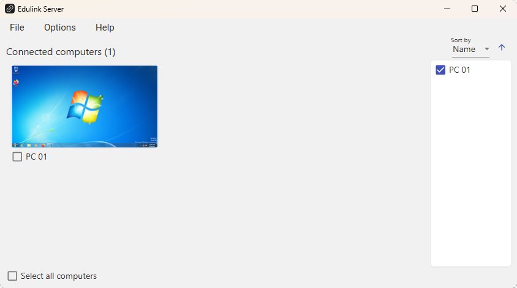
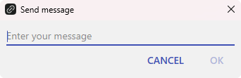
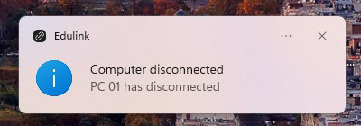
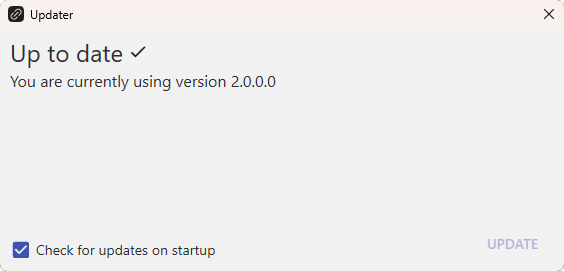
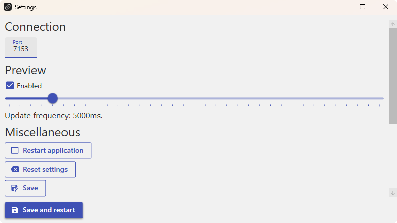
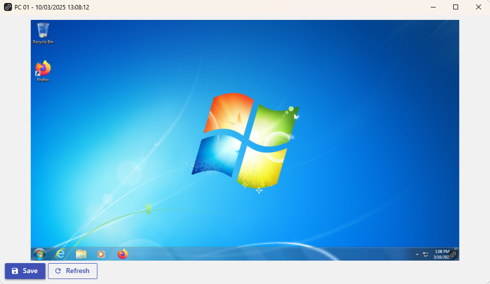
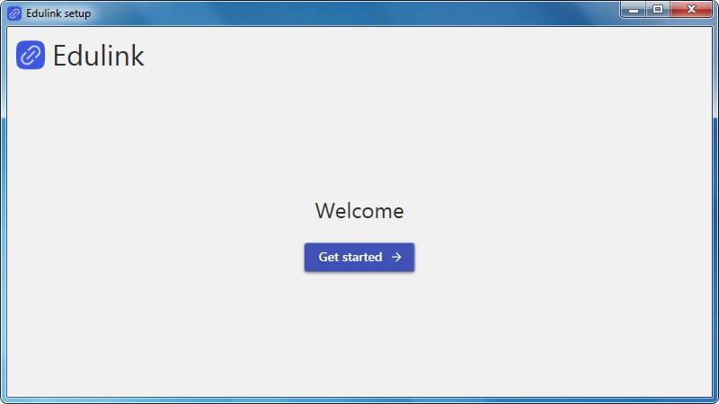
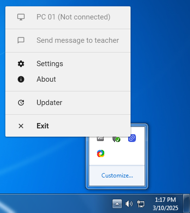
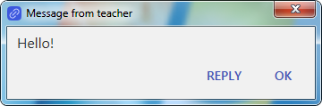

<picture>
    <source media="(prefers-color-scheme: dark)" srcset="Assets/Logo/EdulinkLogoFullDarkTheme.png">
    <source media="(prefers-color-scheme: light)" srcset="Assets/Logo/EdulinkLogoFullLightTheme.png">
    
</picture>

Seamless classroom control at your fingertips

[](https://discord.gg/qdRAdczxPS)
[](https://github.com/lxvdev/Edulink/blob/master/LICENSE.txt)
[](https://github.com/lxvdev/Edulink/commits)
[](https://github.com/lxvdev/Edulink/stargazers)

[](https://github.com/lxvdev/Edulink/issues)
[](https://github.com/lxvdev/Edulink/pulls)

# Downloads
[](https://github.com/lxvdev/Edulink/releases)

### Server - [Download v2.0.1.1](https://github.com/lxvdev/Edulink/releases/tag/v2.0.1.1-server)
### Client - [Download v2.0.1.1](https://github.com/lxvdev/Edulink/releases/tag/v2.0.1.1-client)

The versions of the client and the server aren't the same, here you can download the latest compatible versions.

---
### Migrator - [Download v1.0.0.0](https://github.com/lxvdev/Edulink/releases/tag/v1.0.0.0-migrator) (for older versions of Edulink)

# Important
If a student tries to kill the Edulink process you can press <kbd>⊞ Win</kbd> + <kbd>L</kbd> to lock the screen and then unlock it to restart the application automatically.

You can also search the application in the start menu and start it from there.

# Instructions

<h2 font-size>
    
    Server
</h2>

No setup is required for the server to start working immediately.

1. **Change Port (Optional):**  
   - Navigate to ```File > Settings``` in the application menu.
   - Adjust the port number as needed.

2. **Disable previews (Optional):**
   - Navigate to ```File > Settings``` in the application menu.
   - Uncheck the box for ```Enable desktop preview``` and save. (A restart of the application is required in order to apply the setting)

<h2>
    
    Client
</h2>

1. **Initial Configuration:**  
    When launching the client for the first time, you will be prompted to setup Edulink:
    - **Computer Name:** An identifier for the computer that will be shown on the server.
    - **IP Address:** It can be found on the server on ```File > Settings``` at the bottom.
    - **Port:** The port number used for communication (it should match the server's port).
    - **Password:** A password to prevent students from changing the settings.

2. **Accessing Edulink:**
   - After the setup, Edulink will run in the background and can be accessed from the tray icon.
   - Right-click the icon for quick access to features such as settings, the computer name with the connection status, exiting the app or updating.

# Commands
- **Send Link**: Directly open a specified link on student's computers.
- **Send Message**: Communicate with students and receive their feedback.
- **View Desktop**: Shows the student's desktop.
- **Restart Application**: Restart the Edulink application on student computer as needed.
- **Shut down**: Shuts down student's computer.
- **Restart**: Restarts the student's computer.
- **Lock Screen**: Sends the student to the lock screen.
- **Log Off**: Logs the student off.
- **Rename computer**: Changes the computer name remotely.
- **Update**: Updates the client to the latest version.
- **Reset password**: Resets the password for the client.
- **Block/unblock input**: Blocks or unblocks input on the student's computer.

# Server features
- **Excluding/including preview**: Excludes or includes the preview of the student's desktop.
- **Hiding/showing computers**: Hides or shows the computers on the list (passive mode).
- **Notification on disconnection**: Notifies when a student's computer disconnects.

# Client features
- **Password protection**: Prevents students from changing the settings.
- **Tray icon**: Quick access to the client's features.
- **Automatic startup**: Starts the client automatically when you log in.

# System requirements
- **Architecture:** x86 or x64.
- **Operating system:** Windows 7, 8, 10 and 11.

# Language support
- English
- Spanish
- Polish

# Credits
## Translating
- English - [Andrew](https://github.com/lxvdev)
- Spanish - [Andrew](https://github.com/lxvdev)
- Polish - [R3ikou](https://github.com/R3ikou)

## Thanks to
- [Hardcodet NotifyIcon for WPF](https://github.com/hardcodet/wpf-notifyicon) for the tray icon.
- [Newtonsoft.Json](https://github.com/JamesNK/Newtonsoft.Json) for JSON serialization.

## Special thanks to
- [WPFLocalizeExtension](https://github.com/XAMLMarkupExtensions/WPFLocalizeExtension) for making my life easier.
- [ResX Manager](https://github.com/dotnet/ResXResourceManager) for helping with translations.
- [Material Design In Xaml](https://github.com/MaterialDesignInXAML/MaterialDesignInXamlToolkit) for saving this project (literally).

## Screenshots
### Server







### Client



